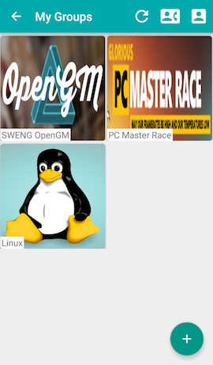

# OpenGM

### Authors

This project has been developed by [Aurélien Soccard](https://github.com/asoccard), [Radoslaw Dryzner](https://github.com/RadoslawDryzner), [Virgile Neu](https://github.com/virgileNeu), [Alexandre Connat](https://github.com/AlexConnat), [André Cibils](https://github.com/AndreCI) and [Nils Bonfils](https://github.com/nbonfils) for a software engeeniring course in third year at EPFL thaught by James Larus (fall 2015). The project has been done under the supervisation of Ireneu Pla and Mohamad Dasthi.

### Description of the project

The purpose of this project is to write an android application with some tools such as Git, Jenkins or Jacoco (code coverage). Our application is a soft and easy group management application.

### Features
We added some features which include:

-  Nice login and signup process with some informations to add and retrieve your friends faster.
-  Group creation process and group joining facilitated.
-  Groups include some chats and members can create different channels to talk about whatever they want. Chats handles notifications at each new message.
-  Groups contains some events : these are some meetings for instance which have a name, date and place and some participants : you can invite only the people that need to see this particular event. You can also easily jump between past and incoming events.
-  Groups hanles some polls : when a member needs the opinion of others in this group, he can simply create a poll with a question, a description, some possible answers, and a deadline. As for events, each poll has a list of participants. Each participant can then vote one time before the deadline, and after this, they can see the results through two nice charts.

## Datas
Our application needs a back end server to work. For this course, we decided to use parse, which is really simple to integrate. If you want to use our application, you need to create an android application blank project on [parse](http://parse.com) following their simple tutorial. At the last step, they generate for you two keys, that you need to copy and paste in the [OpenGMApplication.java](app/src/main/java/ch/epfl/sweng/opengm/OpenGMApplication.java) file. Then, by default, Parse configure the project to create tables from code, so you just need to run the app and this one will create for you the needed table.

## Documentation
Some of the java files are self documented in english. 

## License
GNU GLP V2.0. See LICENSE file in root folder for details. In addition the project depends on Parse API and also an android API to display nice charts : [see this github](https://github.com/Androguide/HoloGraphLibrary).